# GFS 2 米气温预报误差的结构诊断与订正实验

### ——基于南京禄口站 2024—2026 年逐小时观测的实证研究

---

## 摘要

传统的预报检验通常止步于报告一个平均误差，但平均值会把方向相反、来源不同的误差混合在一起，从而掩盖误差的真实形态。本文以南京禄口站（ZSNJ）2024 年 1 月至 2026 年 9 月的 **23,543 组逐小时"预报—观测"配对**为样本，对 GFS 2 米气温预报的误差结构进行诊断，并在此基础上重新审视野外误差订正的收益来源。

主要结果如下。

第一，**误差并不是随机噪声，而是有明确结构。** 全样本平均偏差仅 −0.21 ℃，MAE 却达 1.58 ℃。两者的落差说明误差的主体不是整体性偏移。误差的时间自相关在滞后 1 小时达到 0.90，说明它是与天气过程同步演变的慢变量。

第二，**误差的核心形态是"振幅压缩"——模式系统性地压扁了温度变化的幅度。** 观测平均日较差 9.18 ℃，预报仅 7.68 ℃，压缩 16%；年循环的振幅也被压缩约 11%。误差与观测距平呈显著负相关（误差 = −0.21 − 0.14 × 距平，r = −0.26）：天越冷模式越偏暖，天越热模式越偏冷。这一效应在极端时刻最明显——最冷 1% 的时刻平均偏暖 +4.35 ℃，最暖 1% 的时刻平均偏冷 −2.19 ℃。

第三，**压缩有明确的落点：冬季夜间的最低气温。** 12 月与 1 月的日最低气温分别偏高 +3.33 ℃ 与 +3.55 ℃，而同期日最高气温偏差仅 −0.18 ℃ 与 −0.31 ℃。从日际变率看，预报的日最低气温标准差只有观测的 85%，而日最高气温达到 97%。也就是说，被压缩的是"最低气温"这一侧——模式抓不住夜间强辐射降温。

第四，**误差订正的收益主要来自消除系统性结构，而非复杂的非线性建模。** 在严格时序的三折验证下，六个嵌套方法的 MAE 依次为：原始预报 1.586、常数去偏 1.578（+0.6%）、按月去偏 1.390（+12.4%）、按小时去偏 1.571（+0.9%）、按(月×小时)去偏 1.315（+17.1%）、随机森林 1.225（+22.8%）。随机森林在最强基线上仅额外贡献 5.7 个百分点，且折间标准差最大（±0.232 ℃）。

第五，**一个主动设置的可证伪检验失败了，而这个失败本身很有价值。** 若把南京训练出的订正模型直接用于上海虹桥站，所有方法均失效，随机森林反而使 MAE 变差 11.2%。原因是上海原始误差更小（MAE 1.06 ℃）、且几乎不存在振幅压缩（日较差比值 0.98，南京为 0.84）。这说明这类统计订正模型高度依赖站点，不能简单推广。

第六，**把统计后处理与资料同化放进同一套检验后，后者的信息优势十分明显。** 用长三角 6 个真实机场站做最优插值（OI），在完全独立的评估期上，背景场 RMSE 为 1.770 ℃，"本站气候态偏差订正"只降到 1.702 ℃（改善 3.9%），而最优插值降到 1.439 ℃（改善 18.7%）。站点之间观测新息的相关系数在 0.33—0.56 之间，说明误差存在真实的空间结构；相关长度约在 400—800 km 之间最优。**让误差下降幅度扩大四倍以上的，不是"本站过去平均偏多少"，而是"邻站此刻正在偏多少"。**

本文的方法学意义在于：把"模型准不准"的问题转换为"模型如何错"的问题，并用一个可以被数据推翻的方式检验解释。所附 Web 应用（`streamlit run app.py`）以真实数据实时复现全部结果，且不依赖任何外部 API。

---

## 1 问题的提出

评估一个数值模式的气温预报，最直接的做法是计算平均偏差与均方根误差。这类指标回答的是"错了多少"，但很难回答"错在哪里、为什么错"。

本项目最初的动机来自一个观察：在 23,543 个小时的样本上，GFS 对南京 2 米气温的平均偏差只有 −0.21 ℃——几乎完美。但同一批样本的 MAE 是 1.58 ℃，95 分位绝对误差是 4.40 ℃。

**平均偏差接近 0，而误差量级并不小，这意味着正负误差在长时段平均后相互抵消了。** 这种抵消不是偶然，而是有结构的：误差在不同季节、不同时刻、不同天气状态下呈现不同的符号。

因此本文提出的研究问题是：

> **GFS 对南京 2 米气温的预报误差，具有什么结构？**
> **在这个结构之上，误差订正方法的收益究竟来自哪一部分误差？**

选择这两个问题，是因为它们都指向同一件事：**把"准确率"这类结果指标，转换为可以据以行动的诊断信息。**

---

## 2 数据与方法

### 2.1 数据

本项目全部使用真实数据，不使用任何合成数据。数据来源与处理如下。

| 用途 | 内容 | 来源 | 处理 |
|---|---|---|---|
| 观测（真值） | 南京禄口机场 ZSNJ 逐小时地面观测 | Iowa Environmental Mesonet（METAR 归档） | 气温由 ℉ 换算为 ℃，风速由节换算为 m/s |
| 对照站观测 | 上海虹桥 ZSSS 逐小时观测 | 同上 | 用于跨站点迁移检验 |
| 预报 | GFS 2 米气温预报（历史归档） | Open-Meteo historical-forecast API | 与观测按同一时刻配对 |
| 预报（时效） | GFS 1/2/3/5/7 天预报 | Open-Meteo previous-runs API | 用于误差随预报时效增长的分析 |

主数据集的时间范围为 2024-01-01 至 2026-09-15，共 **23,543 个有效配对小时**（该时段共 23,736 小时，另有 193 小时、约 0.8% 因观测或预报缺测被剔除）。所有时间戳以 UTC 存储，展示时换算为北京时（UTC+8）。

需要说明的是，观测为机场站点，预报为模式格点值，两者下垫面与海拔并不完全一致（模式格点海拔 13 m，站点约 15 m），因此观测中存在一定的代表性误差。这一项在本项目的量级下影响有限，但仍属于误差来源之一。

### 2.2 检验指标

采用与常用检验一致的定义：

$$\text{error} = F - O,\qquad \text{bias} = \overline{F-O}$$

$$\text{MAE} = \overline{|F-O|},\qquad \text{RMSE} = \sqrt{\overline{(F-O)^2}}$$

其中 error > 0 表示模式预报偏高（偏暖）。**bias 是带符号量，正负可以相互抵消；MAE 与 RMSE 反映误差量级，不抵消。** 本文反复利用这两种指标的差异来发现问题，而不是只报告其中一种。

### 2.3 验证方案：为什么必须用严格时序划分

本项目采用**扩张窗口 + 严格时序**的三折验证：

```
第 1 折   训练 ──────────► ｜ 测试 ──────►
第 2 折   训练 ────────────────────► ｜ 测试 ──────►
第 3 折   训练 ──────────────────────────────► ｜ 测试 ──────►
```

每一折的训练数据全部早于测试数据，三折测试段互不重叠且跨越不同季节。所有方法在**完全相同的训练/测试样本**上比较，因此指标差异只来自方法本身。

不采用随机划分的原因很具体：本项目实测误差在滞后 1 小时的自相关达 0.90，12 小时后仍有 0.20。若随机划分样本，同一次天气过程会同时出现在训练集与测试集中，模型等于"见过答案再考试"，指标会显著虚高。

### 2.4 订正方法的嵌套设计

本项目的核心方法学选择是：**不把不同订正方法当作并列的"选手"比较，而是把它们设计成层层嵌套的消融实验。**

| 方法 | 新引入的误差结构 | 这一层回答什么问题 |
|---|---|---|
| ① 原始预报 | 无 | 建立基准 |
| ② 常数去偏 | 全时段平均偏差 | 整体偏移是否为主要误差？ |
| ③ 按月去偏 | 季节调制 | 季节结构的价值是多少？ |
| ④ 按小时去偏 | 日变化 | 单独使用日变化是否有效？ |
| ⑤ 按(月×小时)去偏 | 季节 × 日变化耦合 | 两者是否必须同时考虑？ |
| ⑥ 随机森林 | 六要素的非线性组合 | 非线性订正还能带来多少增量？ |

后一个方法 = 前一个方法 + 一块新的误差结构，因此**每一步的 MAE 下降量直接度量了那块结构的价值**。基线方法采用分组建模加查表（group-mean lookup）：在训练集上计算每个分组的平均误差，在测试集上按组取值作为订正量；当某个组合在训练集中无样本时，依次回退到上一级分组，最后回退到全局平均。这类基线看似朴素，但因为没有方差膨胀、无需调参，在样本充足时能无偏估计系统性偏差，属于难以打败的强基线。用它作为对照，可以避免"只赢弱基线"的常见问题。

### 2.5 误差订正的特征与定义

随机森林的任务被定义为**预测误差本身**（而非直接预测气温）：

$$\widehat{\text{error}} = f(\text{预报气温},\ \text{湿度},\ \text{气压},\ \text{风速},\ \text{小时},\ \text{月份})$$

$$\text{订正后气温} = F - \widehat{\text{error}}$$

特征与原始 WeatherAgent 原型保持一致（6 个特征），随机森林参数为 `n_estimators=200, min_samples_leaf=5, random_state=42`。

---

## 3 结果

### 3.1 总体特征：一个被平均值掩盖的问题

| 指标 | 数值 |
|---|---|
| 样本量 | 23,543 小时 |
| 平均偏差 bias | **−0.21 ℃** |
| MAE | **1.58 ℃** |
| RMSE | 2.12 ℃ |
| 95 分位绝对误差 | 4.40 ℃ |
| 预报与观测相关系数 | 0.983 |

相关系数 0.983 说明预报很好地再现了温度的时间演变；但 MAE 1.58 ℃ 与 95 分位误差 4.40 ℃ 说明逐时刻误差并不小。**bias 与 MAE 之间近八倍的落差，是本项目全部后续分析的起点。**

### 3.2 误差随季节变号，也随日变化变号

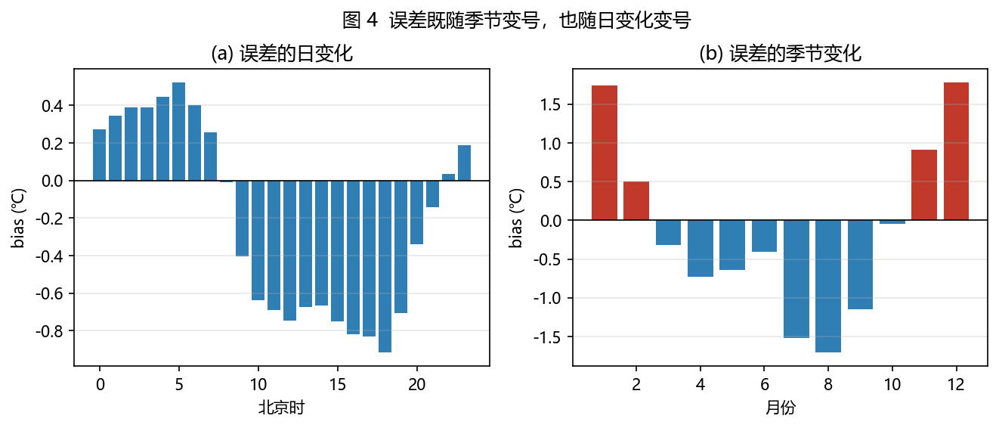

按季节统计，冬季平均偏差 +1.31 ℃，夏季 −1.22 ℃，**符号完全相反**。按月统计，1 月最大（+1.74 ℃，RMSE 3.20 ℃），8 月最小（−1.71 ℃），12 月为 +1.78 ℃。

按北京时统计，偏差从清晨 05 时的 +0.52 ℃ 单调下降到傍晚 18 时的 −0.92 ℃，跨度约 1.44 ℃。

两个结果指向同一个判断：**误差不是恒定的偏移量，而是随季节和日变化改变符号的结构。** 这也预告了一个反直觉的结论——任何"减去一个常数"的订正都不可能有实质效果。

### 3.3 误差与观测距平成反比

以（月份 × 北京时）气候态为基准计算观测距平，考察误差与距平的关系：

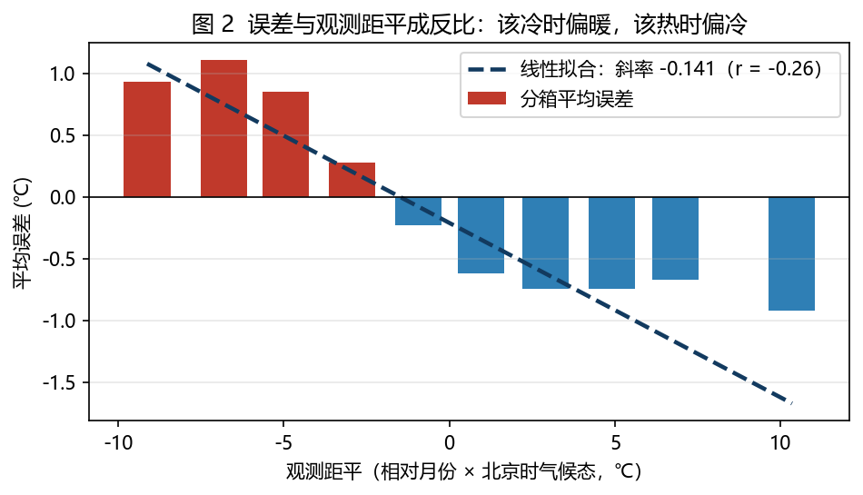

线性拟合得到：

$$\text{误差} = -0.21 - 0.14 \times \text{观测距平}\qquad (r = -0.26,\ n = 23543)$$

分箱结果几乎单调：观测比气候态冷 9.1 ℃ 时，模式平均偏暖 +0.93 ℃；观测比气候态暖 10.3 ℃ 时，模式平均偏冷 −0.93 ℃。

**斜率为负是振幅压缩的直接数学表达**：观测距平每变化 1 ℃，误差朝相反方向变化 0.14 ℃，即模式只还原了约 86% 的距平信号，把真实大气的变化幅度"打了八六折"。

### 3.4 核心发现：振幅压缩及其落点

#### 3.4.0 概念与判据

**振幅阻尼**（amplitude damping）指模式对温度变化的**响应不足**：预报曲线虽然大体跟随观测，但起伏总是偏小——峰值报低了、谷值报高了，整条曲线像被"压扁"了一样。它与"整体偏暖/偏冷"是两回事：整体偏移是曲线上下平移，而振幅阻尼是曲线被压扁，**中间部分可能很准，两端却总是差得多**。

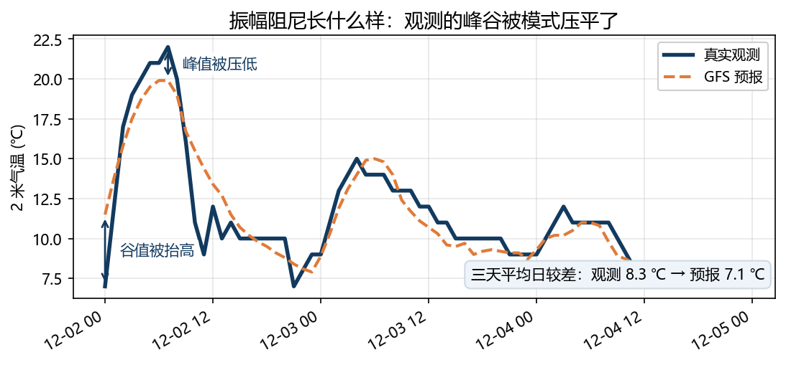

图 11 给出一个直接可见的例子：2024 年 12 月 2 日起三天内，观测峰值 22 ℃ 被预报压到约 19.7 ℃，观测谷值 7 ℃ 被预报抬到约 10 ℃。这三天平均日较差由观测的 8.3 ℃ 降为预报的 7.1 ℃。

如果误差真的来源于"响应不足"，那么它不应只在一处出现。据此提出四条可检验的预测：

| 检验角度 | 如果"振幅阻尼"成立，应该看到 | 数据里的结果 | 判断 |
|---|---|---|---|
| ① 日变化尺度 | 预报的日较差应小于观测 | 9.18 → 7.68 ℃（−16%），冷季仅剩 66% | 成立 |
| ② 强度响应 | 误差应与观测距平成反比 | 斜率 −0.141（r = −0.26） | 成立 |
| ③ 极端时刻 | 越极端的时刻偏差应越大 | 最冷 1% +4.35 ℃／最暖 1% −2.19 ℃ | 成立 |
| ④ 误差落在哪一侧 | 压缩应集中在变化幅度最大的那一侧 | 冬季最低气温 +2.82 ℃／最高气温 −0.42 ℃ | 成立 |

以下 3.4.1 至 3.4.2 节依次给出这四组证据的细节，3.5 节则排除"采样分辨率造成的假象"这一竞争解释。

#### 3.4.1 日较差的逐月结构

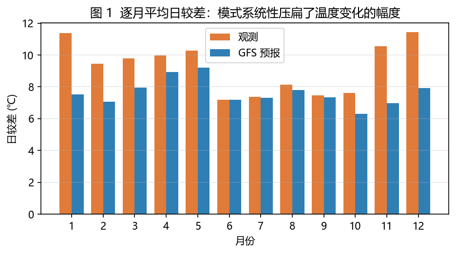

观测平均日较差 9.18 ℃，预报仅 7.68 ℃，压缩 **16.4%**。但压缩并非均匀分布：

| 月份 | 观测日较差 | 预报日较差 | 比值 |
|---|---|---|---|
| 1 月 | 11.38 ℃ | 7.51 ℃ | **0.66** |
| 11 月 | 10.55 ℃ | 6.97 ℃ | **0.66** |
| 12 月 | 11.43 ℃ | 7.92 ℃ | **0.69** |
| 6 月 | 7.20 ℃ | 7.18 ℃ | 1.00 |
| 7 月 | 7.37 ℃ | 7.31 ℃ | 0.99 |

冷季（11—1 月）模式只报出观测日较差的三分之二，而暖季几乎无偏差。**压缩集中在冷季节**——这是后续所有推论的基础。

#### 3.4.2 压缩落在哪一侧：把误差拆成最低气温与最高气温

如果"振幅压缩"只是一个笼统的描述，它不应该给出具体的落点。因此进一步把每日误差拆分为两部分：日最低气温偏差与日最高气温偏差。

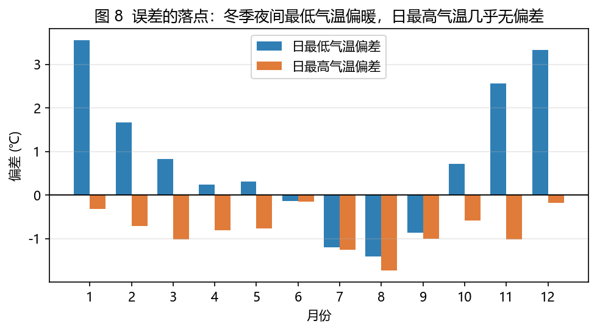

| 时段 | 日最低气温偏差 | 日最高气温偏差 |
|---|---|---|
| 冬季（12—2 月） | **+2.82 ℃** | −0.42 ℃ |
| 夏季（6—8 月） | −0.92 ℃ | −1.05 ℃ |
| 12 月 | **+3.33 ℃** | −0.18 ℃ |
| 1 月 | **+3.55 ℃** | −0.31 ℃ |

从日际变率看，预报的日最低气温标准差只有观测的 **85.4%**，而日最高气温达到 **97.2%**。

**结论非常明确：被压缩的是"最低气温"这一侧。** 冬季模式把日最低气温报高了将近 3 ℃，而日最高气温几乎无偏差，因此日较差被压缩、季节平均偏暖，两个现象其实是同一个问题的两种表现。用一句话概括：**模式抓不住夜间强辐射降温。**

这一落点与前面的证据完全自洽：

- 它解释了为什么最冷的 1% 时刻偏差最大（+4.35 ℃）——这些时刻正是夜间强降温；
- 它解释了为什么冬季整体偏暖（+3.33 ℃ 与 −0.18 ℃ 的净效应）；
- 它也解释了为什么误差与观测距平成反比——模式对"冷"的响应明显弱于对"暖"的响应。

### 3.5 稳健性检验：会不会只是时间分辨率的假象？

本结论面临一个必须排除的可能性：**如果归档预报的时间分辨率低于逐小时观测，那么"日较差偏小"就只是采样造成的假象，与模式无关。**

为此做了两项检验：

**（一）检查预报序列是否为逐小时。** 预报相邻小时取值发生变化的比例为 **93.2%**（即仅 6.8% 重复），说明归档预报确实是逐小时序列，不存在三小时或六小时的阶梯。（作为对照，观测的相邻小时重复率为 42.9%，这是因为 METAR 气温按整摄氏度报出，属正常的量化特征。）

**（二）把观测也降到同样的时间分辨率。** 若压缩源于采样，则把两条序列按相同间隔下采样后，比值应显著回升：

| 采样间隔 | 观测日较差 | 预报日较差 | 比值 |
|---|---|---|---|
| 1 小时 | 9.18 ℃ | 7.68 ℃ | 0.836 |
| 3 小时 | 8.61 ℃ | 7.27 ℃ | 0.844 |
| 6 小时 | 7.73 ℃ | 6.59 ℃ | 0.852 |
| 12 小时 | 2.22 ℃ | 1.81 ℃ | 0.819 |

压缩比值在 0.82—0.85 的窄区间内保持稳定，**采样效应被排除**。此外，距平回归的斜率在全部样本（−0.141）与仅取预报变化时刻（−0.147）之间也几乎不变，说明结论不依赖于阶梯平台上的样本。

### 3.6 订正收益的来源分解

在上述诊断基础上，用六个嵌套方法检验订正的收益来自哪里。

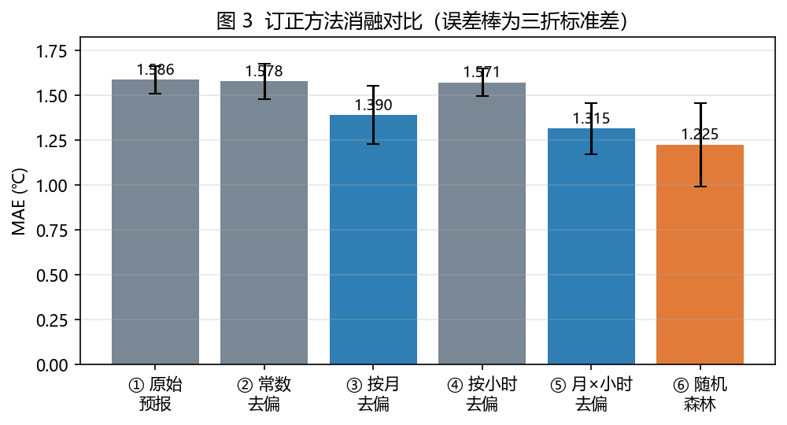

| 方法 | MAE（均值 ± 折间标准差） | 相对原始改善 | 本层新增改善 |
|---|---|---|---|
| ① 原始预报 | 1.586 ± 0.076 | — | — |
| ② 常数去偏 | 1.578 ± 0.100 | +0.6% | +0.6% |
| ③ 按月去偏 | 1.390 ± 0.162 | +12.4% | +11.9% |
| ④ 按小时去偏 | 1.571 ± 0.077 | +0.9% | （对照项） |
| ⑤ 按(月×小时)去偏 | 1.315 ± 0.143 | +17.1% | +16.1% |
| ⑥ 随机森林 | **1.225 ± 0.232** | **+22.8%** | +5.7% |

各折明细显示结论不依赖单一折：

| 方法 | 第 1 折 | 第 2 折 | 第 3 折 |
|---|---|---|---|
| ① 原始预报 | 1.610 | 1.647 | 1.501 |
| ③ 按月去偏 | 1.571 | 1.340 | 1.258 |
| ⑤ 按(月×小时)去偏 | 1.480 | 1.236 | 1.229 |
| ⑥ 随机森林 | 1.493 | 1.096 | 1.086 |

三个反直觉但重要的读法：

**（1）常数去偏几乎无效（+0.6%）。** 因为全时段平均偏差本来就只有 −0.21 ℃——需要消除的偏移本身并不存在。这直接否定了"后处理 = 消除系统偏差"的常见直觉。

**（2）单独按小时去偏也几乎无效（+0.9%），而按月去偏有 +12.4%。** 原因是日变化偏差在冬夏符号相反，在长时段平均后互相抵消；季节才是主导的调制因子。但一旦把两者组合，改善立刻跳到 +17.1%（本层新增 16.1 个百分点）——说明误差的真实结构是**季节与日变化的耦合**，而不是两者各自独立叠加。

**（3）随机森林在最强基线上仍有增量，但代价是稳定性。** 额外贡献 5.7 个百分点，方向明确；但它的折间标准差是六个方法中最大的（±0.232 ℃），第 1 折（1.493）甚至不如基线⑤（1.480）。**这是一个真实的权衡，不应被平均值掩盖。**

随机森林的特征重要性排序为：预报气温 0.291、风速 0.200、湿度 0.156、小时 0.137、月份 0.122、气压 0.094。风速与湿度的高重要性具有物理意义——两者都与边界层湍流交换和地表能量收支密切相关，正是"夜间辐射降温"这一过程的核心变量；这与第 3.4 节给出的解释方向一致。时间变量的重要性合计约 0.26，说明订正量中确实有很强的气候态成分。

### 3.7 一个主动设置的可证伪检验：跨站点迁移

如果订正模型本质上学到的是**南京特有的"季节—日变化"偏差结构**，那么把它原样搬到另一站点，性能就应当下降。这是一个明确的、可以推翻上述整套解释的检验。

结果如下（南京 ZSNJ 训练，上海 ZSSS 测试，使用同一时段）：

| 方法 | 上海 MAE | 相对上海原始改善 |
|---|---|---|
| ① 原始预报 | 1.062 ℃ | — |
| ② 常数去偏 | 1.052 ℃ | +1.0% |
| ③ 按月去偏 | 1.047 ℃ | +1.5% |
| ④ 按小时去偏 | 1.148 ℃ | −8.0% |
| ⑤ 按(月×小时)去偏 | 1.076 ℃ | −1.3% |
| ⑥ 随机森林 | 1.182 ℃ | **−11.2%** |

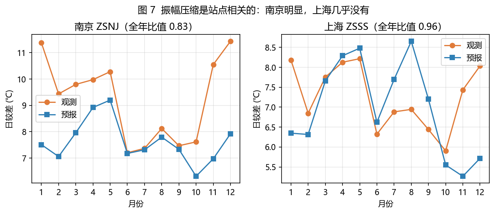

**预测成立，而且比预想更彻底：所有订正方法在上海都失效。** 原因有两层：

其一，上海本身的原始预报误差就小得多（MAE 1.06 ℃，南京 1.58 ℃），**在误差本来就小的站点上，额外订正只会引入噪声**；

其二，诊断显示上海几乎不存在振幅压缩问题——日较差比值为 0.977（南京为 0.836），冬季日最低气温偏差也只有 +1.39 ℃（南京为 +2.82 ℃）。

因此，这个失败结果不仅没有削弱前面的解释，反而从反面支持了它：**振幅压缩是站点相关的现象，其对应的订正模型也同样具有站点依赖性。**

### 3.8 真实案例：两种相反的过程

统计诊断需要放回具体天气过程中检验。选取两个方向相反的过程，并且**订正模型仅使用过程开始之前的数据训练**，构成严格的样本外检验。

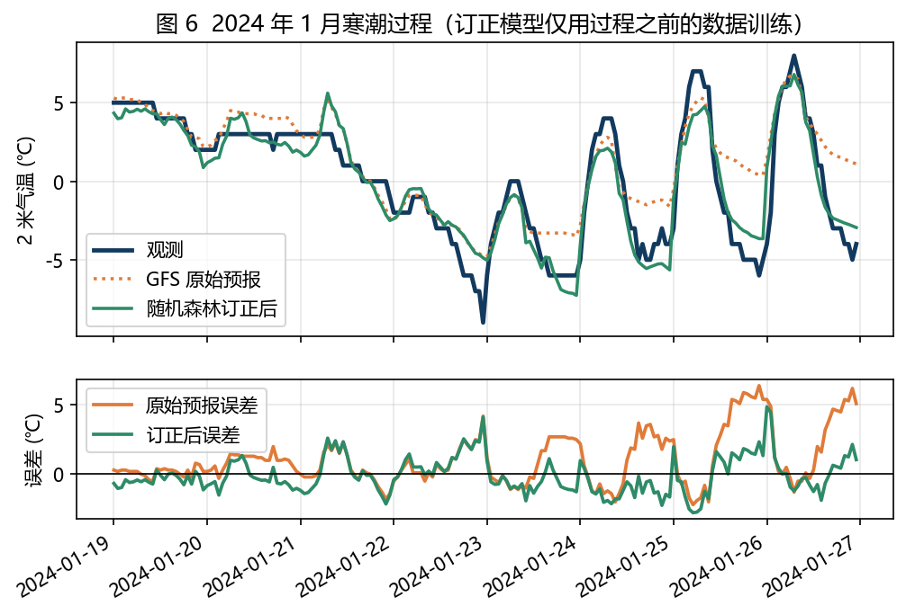

**案例一：2024 年 1 月 19—26 日寒潮过程。** 观测气温在 −9.0 ℃ 至 +8.0 ℃ 之间变化。过程期间模式明显偏暖（bias +1.08 ℃），正是"该冷的时候不够冷"。平均日较差：观测 7.12 ℃，预报仅 4.71 ℃（比值 0.66）——**振幅压缩在真实过程中肉眼可见**。

| 方法 | bias | MAE | RMSE | 最大绝对误差 |
|---|---|---|---|---|
| 原始预报 | +1.08 ℃ | 1.53 ℃ | 2.18 ℃ | 6.40 ℃ |
| 按(月×小时)去偏 | −0.91 ℃ | 1.54 ℃ | 1.87 ℃ | 5.28 ℃ |
| 随机森林 | −0.09 ℃ | **1.02 ℃** | 1.29 ℃ | 4.87 ℃ |

值得注意的是，简单查表法在这个案例中几乎没有改善 MAE（1.53 → 1.54 ℃），因为它针对的是气候态平均状态，不针对具体过程；而随机森林把最大绝对误差从 6.4 ℃ 降到 4.9 ℃。

**案例二：2024 年 8 月 1—12 日持续高温过程。** 观测最高气温达 41.0 ℃。模式明显偏冷（bias −2.11 ℃），即"该热的时候不够热"。这里误差主要表现为**整体的系统性偏移**而非日较差压缩（日较差比值 0.94），提示振幅压缩的强弱随季节变化，需要分开讨论。

两个案例的偏差符号相反，但机制一致：**该冷时不够冷，该热时不够热——模式把温度变化的幅度抹平了。**

平均指标会让人以为"模式表现还可以"（MAE 1.53 ℃），但在一次真实过程中，关键时刻的误差可以达到 6.4 ℃。对预报员与公众而言，**关键时刻的误差远比平均误差更有意义**，这正是本项目从"平均误差"走向"误差结构"的直接动机。

### 3.9 误差随预报时效的变化

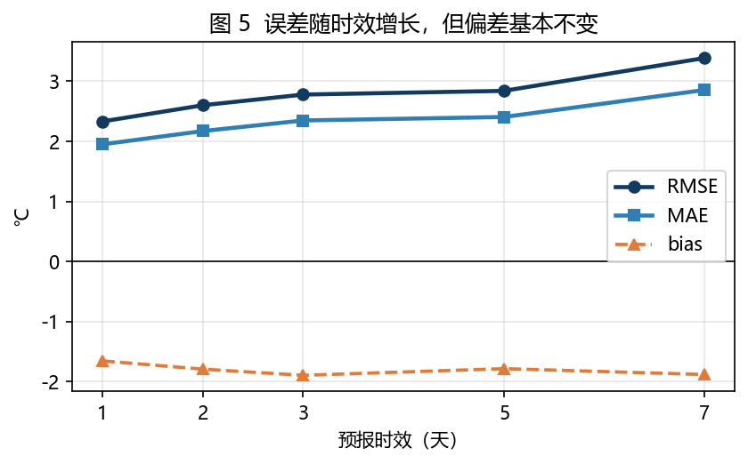

| 时效 | bias | MAE | RMSE | 相关系数 |
|---|---|---|---|---|
| 1 天 | −1.65 ℃ | 1.95 ℃ | 2.33 ℃ | 0.902 |
| 2 天 | −1.79 ℃ | 2.17 ℃ | 2.60 ℃ | 0.870 |
| 3 天 | −1.89 ℃ | 2.35 ℃ | 2.78 ℃ | 0.849 |
| 5 天 | −1.78 ℃ | 2.41 ℃ | 2.84 ℃ | 0.821 |
| 7 天 | −1.88 ℃ | 2.86 ℃ | 3.39 ℃ | 0.731 |

RMSE 从 1 天的 2.33 ℃ 增长到 7 天的 3.39 ℃（约 1.5 倍），相关系数由 0.90 降至 0.73，符合误差随预报时效增长的预期。

但有一处细节值得注意：**偏差几乎不随时效变化**（始终在 −1.65 至 −1.89 ℃ 之间）。如果系统性偏差主要来自初值误差随时间放大，它不应如此稳定。更合理的解释是——这一偏差反映的是**模式物理过程本身的固有倾向**，而非初始化问题。这一判断直接影响订正策略：订正的对象应当是"模式的系统性行为"，而不是"初始误差"。

（说明：时效数据的归档仅覆盖最近 92 天，因此对应时段为 2026 年 6—9 月，偏差整体偏负与夏季特征一致，季节性代表有限。）

### 3.10 资料同化实验：邻站观测能否改进本站预报？

前面九节的订正方法都只用**单个站点自己的历史数据**。一个自然的问题是：如果改用**同一时刻周边站点的观测**，效果会不会更好？这正是资料同化要回答的问题，也是本项目与本科阶段专业方向（数值预报、中尺度气象、资料同化）连接最紧的一部分。

#### 3.10.1 实验设计

使用长三角 6 个真实机场站（南京禄口、合肥新桥、上海虹桥、上海浦东、杭州萧山、宁波栎社）的逐小时 2 米气温，共 141,109 组"观测—背景场"配对。背景场取 GFS 2 米气温预报在各站位置的值。标定期为 2024 年全年，评估期为 2025-01-01 起，两者完全不重叠。

方法对比三种做法：

1. **背景场**：GFS 原始预报；
2. **本站气候态偏差订正**：减去该站在标定期估计的平均偏差（传统统计后处理的代表）；
3. **最优插值（OI）**：`x_a = x_b + B Hᵀ(H B Hᵀ + R)⁻¹ (y − H x_b)`，其中 B 采用均匀各向同性的高斯相关模型，R 取对角观测误差。

检验采用**留一站交叉检验**：分析某一站时，把该站**整个从方程组中剔除**，只用其余 5 站的观测，再与该站的真实观测比较。

关于误差方差的口径需要说明：从数据中能直接估计的只有新息总方差 `Var(bg − obs) = σb² + σo² = 2.76 ℃²`。本项目不把它整体当作 σb，而是给定 σo 后反解 `σb² = max(总方差 − σo², 小量)`，避免把观测误差重复计入。

#### 3.10.2 结果

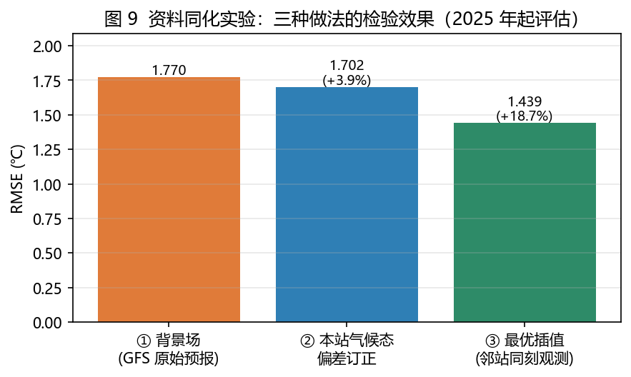

| 方法 | bias (℃) | MAE (℃) | RMSE (℃) | 相对背景场改善 |
|---|---|---|---|---|
| ① 背景场（GFS 原始预报） | −0.359 | 1.336 | 1.770 | — |
| ② 本站气候态偏差订正 | +0.039 | 1.245 | 1.702 | +3.9% |
| ③ **最优插值（邻站同刻观测）** | −0.050 | **1.063** | **1.439** | **+18.7%** |

（评估样本 88,837；相关长度 L = 500 km，观测误差 σo = 1.0 ℃。）

OI 在 6 个站上都带来了改善，幅度为 13.6%—23.5%。相比之下，传统的本站偏差订正只能改善 3.9%。

#### 3.10.3 为什么 OI 会有效：误差的空间相关

OI 能起作用的前提是**不同站点的误差彼此相关**。本项目直接计算了各站观测新息之间的相关系数：任意两站的相关系数都在 **0.33—0.56** 之间，且全部为正；其中距离最近的上海虹桥—上海浦东为 0.54，南京—合肥为 0.56。

这说明 GFS 在该区域的温度误差以**空间上相互关联的共同成分为主**——模式在某站偏高时，邻近站往往也偏高。因此邻站的观测确实携带关于本站误差的信息。

#### 3.10.4 参数敏感性：相关长度与观测误差

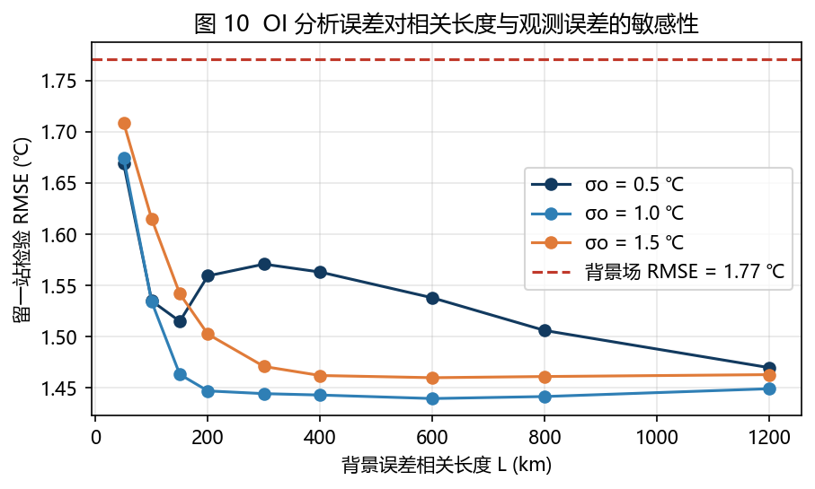

- **相关长度 L 太小（50 km）时**，站点之间的协方差接近 0，权重也接近 0，分析几乎退化为背景场，误差与不订正时相同；
- **L 增大到 400—800 km 后**误差趋于稳定，说明该区域内误差的相关尺度远大于站间距；
- **观测误差 σo 越大**，分析越保守：σo = 1.5 ℃ 时改善明显缩水，因为此时系统更倾向于相信背景场。

两个容易出错的技术细节（也是本项目在实现过程中实际修正过的）：

1. **σo 必须小于新息总标准差（1.66 ℃）。** 若取 σo = 2 ℃（σo² = 4 > 总方差 2.76），相当于宣称"观测误差比总误差还大"，逻辑上不成立，此时 σb 被压到接近 0，分析退化为不订正。
2. **σo 很小时会出现负权重。** 当观测误差设得很小，OI 会自动扣除"已被邻近站点重复提供"的信息，因此个别权重为负。负权重在最优插值中是合法的（表示去除冗余），但会让分析对观测噪声更敏感。

#### 3.10.5 与业务资料同化的距离

本实验实现的是最优插值的核心思想与权衡，与业务同化系统仍有明确差距：只处理 2 米气温单变量；背景误差协方差为均匀各向同性、只有一个相关长度；观测仅 6 个地面站；分析位置限于站点与规则网格；不与模式动力约束耦合。因此它不能替代 3D-Var 或 EnKF，但足以说明一件事：**在这个站点网络上，误差的空间相关结构真实存在，而且可以被利用。**

---

## 4 讨论

### 4.1 为什么"振幅压缩"比"存在系统偏差"更有价值

"模式存在 1 ℃ 的系统性偏差"这句话几乎没有可操作性——它既不能说明偏差从哪来，也无法预测偏差在什么时候最严重。而"模式在冬季夜间的最低气温上偏高约 3 ℃，同时日最高气温基本准确"这一诊断，则同时给出了**位置**（夜间最低气温）、**时间**（冬季）、**量级**（约 3 ℃）与**物理指向**（夜间辐射降温过程未被充分刻画）。

更重要的是，它预测了误差在其他情况下的行为：如果模式对"冷"的响应不足，那么冷空气过程、极端低温、强辐射降温的夜晚就应当偏得最厉害。第 3.4 节与第 3.8 节的结果验证了这些预测。**一个诊断的价值，很大程度上取决于它能预测多少尚未检验的现象。**

### 4.2 与已有认识的对应

模式对气温日较差的系统性低估、以及对近地面夜间降温过程刻画不足，是数值天气预报中已被广泛讨论的老问题，通常与陆面—大气耦合、边界层参数化、近地层通量交换等过程有关。本文并没有提出新的物理机制，而是用一套可复现的诊断流程，**在一个具体的站点、具体的模式、具体的时间段上，把这一现象定量地定位到"最低气温"这一侧**。

需要谨慎的是：本项目使用的预报为归档产品（可能经过供应商的统计后处理与降尺度），因此所诊断的误差结构是**该数据产品**的误差结构，而不能直接等同于 GFS 模式本身的误差。这一点在本项目的局限中明确列出。

### 4.3 方法学反思

本研究有三个方法学选择值得记录，它们都能被推广到其他检验工作：

**第一，用嵌套消融代替模型竞赛。** 常见的做法是把多个模型并排比较、报告最优者。但那样只能得到"谁更好"，无法回答"为什么更好"。嵌套设计把这个问题拆解为若干可度量的增量。

**第二，主动设计可证伪的检验。** 跨站点迁移实验是本项目中最有价值的实验之一，因为它主动为已有解释寻找反例。它失败了，但失败的方式与解释的预测完全一致——这比一次成功的迁移更能支持结论。

**第三，先排除最容易被质疑的可能性。** 在报告"日较差被压缩 16%"之前，必须先排除"这只是时间分辨率造成的假象"。这一检验（第 3.5 节）并不复杂，但如果没有做，整个核心结论都会失去说服力。

### 4.4 实际意义

从预报应用的角度看，本项目的结论提示：对南京这类站点，**逐时气温订正的重点应放在夜间最低气温与冷季节**；而在误差本已较小的站点，订正反而可能带来负面影响，应先做误差结构诊断再决定是否订正。

---

## 5 局限

本研究存在以下明确局限（同时也是后续工作的入口）：

1. **站点覆盖有限。** 主站点仅南京，另有上海作对照。跨站点迁移实验已显示结论不能直接推广，因此本文的所有结论都应限定在"南京站、GFS 归档预报、2024—2026 年"这一范围内。
2. **无法检验降水。** 实测 ZSNJ、ZSSS、ZSPD 三个机场的 METAR 归档中，逐小时降水量字段全部为 0 或缺失——中国机场例行观测不报降水量。开展降水检验需改用 GPM IMERG 或 CHIRPS 等卫星降水产品。本项目选择明确标注这一限制，而不是用模式自身的降水场作为"真值"，以避免循环论证。
3. **代表性误差。** 观测为机场站点，预报为格点值，两者下垫面与海拔不完全一致。
4. **仅检验 2 米气温。** 温度与降水的误差结构往往不同，不能相互推断。
5. **时效数据时段较短。** 归档仅保留最近 92 天，季节代表性不足。
6. **纯统计后处理缺乏物理约束。** 订正模型不具备外推能力，在训练样本未覆盖的天气状态下表现无法保证。
7. **预报产品是归档数据。** 可能包含供应商的统计后处理，因此所诊断的是"该数据产品"的误差，而非模式的原始误差。
8. **资料同化实验是单变量、离线、简化协方差的版本。** 只有 2 米气温、6 个地面站、均匀各向同性背景误差协方差，且不与模式动力约束耦合（详见 3.10.5）。

### 被数据推翻的假设

研究过程中有四个假设被数据否定，记录如下：

1. ~~"误差订正的主要作用是消除系统性偏差"~~ → 常数去偏仅改善 0.6%。
2. ~~"按小时去偏就能抓住日变化误差"~~ → 仅改善 0.9%。
3. ~~"随机森林学到的订正关系可以推广到其他站点"~~ → 迁移到上海后 MAE 反而变差 11.2%。
4. ~~"模式误差主要由随机噪声构成"~~ → 滞后 1 小时自相关达 0.90。

---

## 6 结论

本文以 23,543 组逐小时真实配对为样本，诊断了 GFS 对南京 2 米气温预报的误差结构，并检验了误差订正的收益来源。结论如下。

1. **误差具有明确结构，而非随机噪声。** 平均偏差 −0.21 ℃ 与 MAE 1.58 ℃ 的落差、以及误差滞后 1 小时 0.90 的自相关，共同说明误差是与天气过程同步演变的系统性偏差。
2. **误差的核心形态是振幅压缩，且压缩落在冬季夜间的最低气温。** 观测日较差被压缩 16.4%（冷季达 34%）；冬季日最低气温偏高 +2.82 ℃，而日最高气温偏差仅 −0.42 ℃；误差与观测距平显著负相关（斜率 −0.14）。该结论通过了时间分辨率稳健性检验。
3. **误差订正的收益主要来自消除系统性结构。** 在严格时序的三折验证下，随机森林将 MAE 从 1.586 ℃ 降至 1.225 ℃（+22.8%），但在最强的查表基线上仅额外贡献 5.7 个百分点，同时折间稳定性下降。
4. **这些订正关系不可跨站点迁移。** 南京训练的模型在上海全部失效，随机森林使 MAE 变差 11.2%，原因是上海几乎不存在振幅压缩。
5. **在真实天气过程中，上述结构可以直接观察到。** 2024 年 1 月寒潮期间模式偏暖（+1.08 ℃）且日较差被压缩至观测的 66%；2024 年 8 月高温期间模式偏冷（−2.11 ℃）。

6. **资料同化提供的信息远多于单站统计后处理。** 在长三角 6 站网络上，最优插值把 RMSE 从 1.770 ℃ 降到 1.439 ℃（+18.7%），而本站气候态偏差订正只能降低 3.9%；站间新息相关系数 0.33—0.56，证明误差的空间结构真实存在且可利用。

**本项目的主要贡献不在于提高预报精度，而在于把"模型准不准"转换为"模型如何错"，并用一个可以被数据推翻的方式检验了解释。**

---

## 附录 A　复现说明

```bash
# 1. 安装依赖
pip install -r requirements.txt

# 2. （可选）重新抓取公开数据；仓库已内置数据文件
python tools/real_data.py

# 3. 运行完整分析，导出全部结果表
python analysis/run_verification.py

# 4. 生成报告图表
python analysis/make_figures.py
python analysis/make_da_figures.py

# 5.（资料同化实验）抓取 6 站观测与网格背景场
python analysis/build_da_dataset.py
python analysis/build_da_grid.py

# 6. 启动交互式应用
streamlit run app.py
```

应用读取仓库内的 CSV 文件，**离线即可运行，不需要任何 API Key**。

所有图表与表格均可由上述脚本从原始数据重新生成，本文中出现的每一个数字都由 `analysis/run_verification.py` 输出。

## 附录 B　代码与数据来源

- 观测数据：Iowa Environmental Mesonet, ASOS/METAR archive（<https://mesonet.agron.iastate.edu/request/download.phtml>）
- 预报数据：Open-Meteo Historical Forecast API 与 Previous Runs API（<https://open-meteo.com/>）
- 主要分析代码：`tools/real_data.py`（数据抓取与配对）、`tools/verification.py`（检验与消融）、`tools/amplitude.py`（振幅诊断）、`analysis/run_verification.py`（完整流程）

---

*本文档由项目内脚本自动生成的数值结果撰写，所有数字均可在应用对应页面中交互复现。*
